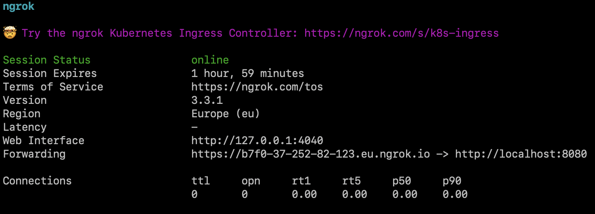
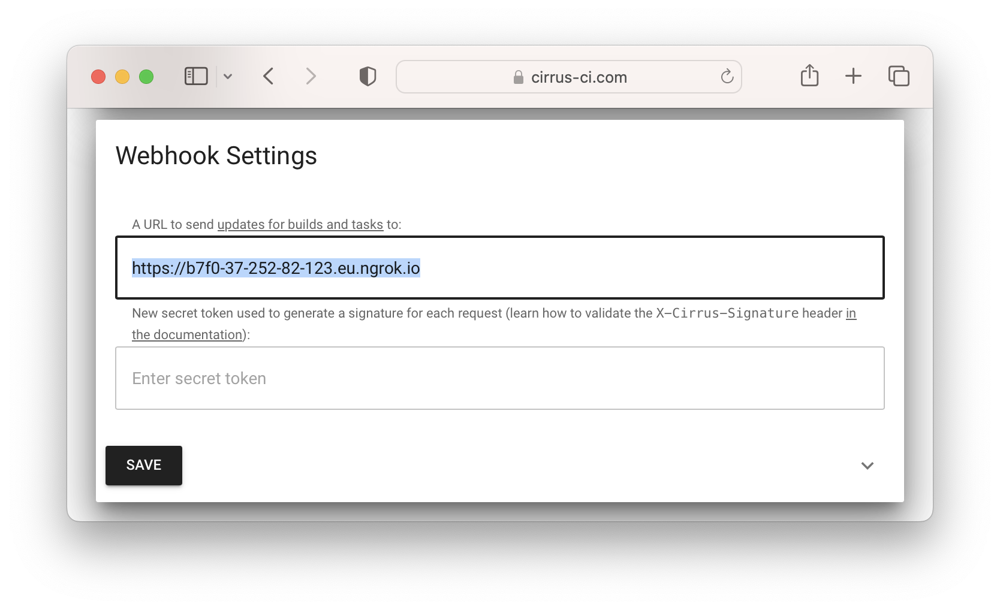
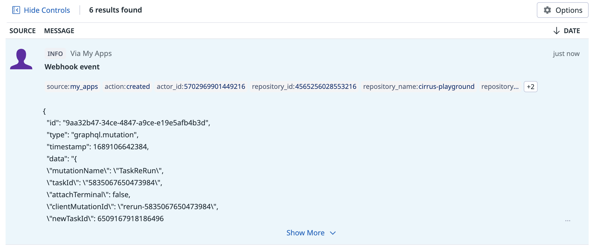

# Cirrus Webhooks Server

Examples of the webhook event processors from the Cirrus CI.

## DataDog processor

This processor receives, enriches and streams Cirrus CI webhook events to DataDog.

### Usage

```
docker run -it --rm ghcr.io/cirruslabs/cirrus-webhooks-server:latest datadog
```

The following command-line arguments are supported:

* `--dogstatsd-addr` (`string`) — DogStatsD address to send the events to (defaults to `127.0.0.1:8125`)
* `--event-type` (`string`) — event type to process (for example `build`, `task` or `audit_event`) (defaults to `audit_event`)
* `--http-addr` (`string`) — address on which the HTTP server will listen on (defaults to `:8080`)
* `--http-path` (`string`) — HTTP path on which the webhook events will be expected (defaults to `/`)
* `--secret-token` (`string`) — if specified, this value will be used as a HMAC SHA-256 secret to verify the webhook events

### Example

The simplest way to try this processor is to use Docker and [ngrok](https://ngrok.com/).

First, you'll need to run the DataDog agent locally. The easiest way to do that would probably be [a Docker container](https://docs.datadoghq.com/containers/docker/?tab=standard), just don't forget to expose the DogStatsD port by adding the following argument to `docker run`:

```
-p 8125:8125/udp
```

Then, run the DataDog processor:

```sh
docker run -it --rm -p 8080:8080 ghcr.io/cirruslabs/cirrus-webhooks-server:latest datadog --dogstatsd-addr=host.docker.internal:8125
```

Note the `--dogstatsd-addr=host.docker.internal:8125`, it shows the DataDog processor where to find the DogStatsD daemon. In this case, it's on the Docker's host machine.

Finally, [install](https://ngrok.com/download) and run `ngrok` to expose our DataDog processor's HTTP server to the internet:

```sh
ngrok http 8080
```

This will open the following TUI window:



You'll need to copy the forwarding address and set it in your organization's settings in the Cirrus CI app:



Now you can run some tasks, and the corresponding audit events will appear shortly in your "Events Explorer":


